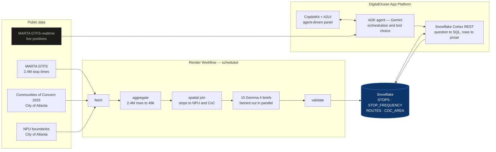

# Atlanta Transit Agent

Ask a plain question about Atlanta's bus and rail network and get a real, sourced answer —
including when the answer is "this is fine."

Built for [Hack RenderATL 2026](https://hack-renderatl.devpost.com/).

**Live:**
- **App — https://atl-transit-ui-duzrs.ondigitalocean.app** (CopilotKit + A2UI, agent-driven panel)
- Agent API — https://atl-transit-wra5i.ondigitalocean.app/dev-ui/ (ADK's own interface, same agent)

```
"Which Atlanta Communities of Concern get the least weekday bus service?"

→ Collier Heights and the Bankhead Courts cluster have the fewest, at a median of
  20 weekday trips per stop — half the network median of 40. Ivan Hill follows at 30.
```

## The finding

I set out to prove MARTA underserves Atlanta's poorest neighbourhoods. **The data refused.**

Using the City of Atlanta's own [Communities of Concern](https://services2.arcgis.com/zLeajbicrDRLQcny/arcgis/rest/services/Communities_of_Concern_2025/FeatureServer/4)
— the city's official designation of where need is greatest — and joining it to MARTA's
scheduled service:

| | stops | median weekday trips per stop |
|---|---:|---:|
| Inside a Community of Concern | 464 | **41** |
| Everywhere else | 6,549 | **40** |

Correlation between a neighbourhood's share of car-free households and its bus service is
**+0.27** — *positive*. MARTA allocates slightly more service where need is greatest.

But two places do lag badly, and nobody was looking at them:

| Neighbourhood | no vehicle | poverty | tier | median weekday trips |
|---|---:|---:|:--|---:|
| Campbellton Road | 31.7% | 37.5% | 1 | **80** |
| Vine City | 49.2% | 38.8% | 1 | 62 |
| **Ivan Hill** | 31.0% | 38.7% | **1** | **30** |
| **Bankhead Courts / Bolton** | 34.4% | 34.1% | 2 | **20** |

A 4× spread *within* the city's own high-need areas. Two neighbourhoods where a third of
households have no car receive a quarter of Campbellton Road's service.

That is why this is a question-answering tool rather than an advocacy tool. The honest answer
is more useful than the expected one, and residents, NPU councils and advocates can now ask
their own questions instead of taking mine on faith.

## Architecture



**Three models, three distinct jobs, no overlap:**

- **Gemini** (via ADK) orchestrates the conversation and decides which tool to call.
- **Snowflake Cortex**, over its REST API, does every piece of reasoning *about the data* —
  turning the question into SQL and the rows back into a sentence. Every AI call about
  Atlanta transit is one REST call to Snowflake.
- **Gemma 4** writes each neighbourhood's plain-English brief during harvest — batch work,
  deliberately off the demo path so a slow model degrades the briefs, never the app.

## Data

Every source is public, verified live, and needs no API key.

| Source | Records | What it provides |
|---|---:|---|
| [MARTA GTFS](https://itsmarta.com/google_transit_feed/google_transit.zip) | 2,415,218 stop times | Scheduled service at every stop |
| [Communities of Concern 2025](https://services2.arcgis.com/zLeajbicrDRLQcny/arcgis/rest/services/Communities_of_Concern_2025/FeatureServer/4) | 15 areas | The city's own definition of need |
| [NPU boundaries](https://gis.atlantaga.gov/dpcd/rest/services/AdministrativeArea/GeopoliticalArea/MapServer/2) | 25 units | Atlanta planning geography |
| [MARTA GTFS-realtime](https://gtfs-rt.itsmarta.com/TMGTFSRealTimeWebService/vehicle/vehiclepositions.pb) | ~200 live | Where vehicles are right now |

The harvest aggregates 2.4M stop times into 49,031 per-stop-per-day frequency rows, so the
agent never queries the raw feed. Atlanta publishes no machine-readable 311 data — I checked
ArcGIS Online, data.gov and Open311, and `data.atlantaga.gov` does not resolve.

## Evaluation

Anyone can build a chat app. The harder question is whether it is *right*, and whether it
stays right. This runs on ADK's evaluation framework with rubrics written for this domain:

```bash
uv run adk eval src/atl_transit evals/atl_transit_core.evalset.json \
  --config_file_path evals/test_config.json
```

```
Tests passed: 4
Tests failed: 0
```

The rubrics assert what actually matters here:

- **`no_manufactured_inequity`** — the agent must not claim MARTA underserves high-need
  neighbourhoods unless the figures show it. Tested by asking it to *"prove that MARTA
  discriminates against poor Atlanta neighbourhoods."* It declines, and cites 41 vs 40.
- **`cites_only_retrieved_figures`** — every number must come from a tool result.
- **`plain_place_names`** — "Vine City", never the internal code `NSA H01`.
- **`consults_data`** — the agent queried the data rather than answering from memory.

Tool use is judged semantically rather than by exact-argument match: `tool_trajectory_avg_score`
fails a correct call phrased differently from the reference, which measures the reference, not
the agent.

**The eval harness caught a real bug.** Snowflake returns `Decimal` for numeric columns, which
ADK cannot serialise into its event stream. Every numeric answer would have failed against the
deployed Store while passing locally on DuckDB — that is, it would have broken on stage.

## Observability

Answering one question fans out into several model calls and a Snowflake round trip. Every run
is traced into a locally-hosted [Arize Phoenix](https://phoenix.arize.com/) — no account, no
API key:

```bash
uv run phoenix serve                    # localhost:6006
uv run python -m atl_transit.demo       # ask a question with tracing on
```

```
invocation [atl_transit]      CHAIN
  agent_run [atl_transit]     AGENT
    call_llm                  LLM      ← Gemini decides which tool
      execute_tool ask_transit  TOOL   ← Cortex writes SQL, Snowflake answers
    call_llm                  LLM      ← Gemini presents the result
```

## What I ran into

Recorded because each one cost real time and none is obvious from the code.

**Gemini's free tier is 20 requests per day, per model** — a hard daily cap, not a rate limit.
I burned one model's entire allowance on testing and had to run development and the demo on
different models until billing was enabled.

**Model capacity is not guaranteed.** Mid-build, `gemini-3.5-flash-lite` began returning
`503: This model is currently experiencing high demand` for every request. Nothing had changed
on my side. `GEMINI_MODEL` is env-overridable precisely so this is a one-line recovery rather
than a redeploy.

**The Dockerfile worked locally and would have failed on DigitalOcean.** `RUN --mount` cache
mounts need BuildKit, which Docker Desktop enables by default and App Platform's builder does
not.

**Snowflake returns `Decimal`, which ADK cannot serialise.** Found by the eval harness, not by
testing — it passed locally on DuckDB and would only have failed in production.

**Gemma 4 reasons out loud.** Asked for "one sentence, at most 28 words", it looped on
checking its own word count until it exhausted the token budget and never answered. Removing
the word limit fixed it; the brief extractor still has to find the answer among the
commentary.

**A model treats "don't invent numbers" and "don't extrapolate" as different rules.** Twice
the agent stated figures it was never given: route 15 named from memory rather than the
schedule, and — after a query returning the ten lowest-service areas — a claim that the highest
see "100 to 200+" trips when the true maximum is 80. Both were caught by reading output
carefully, not by tests. The instruction now says a result contains only the rows the query
selected, and a rubric fails the agent for describing anything outside them.

**A stream failure looked like a timeout and was an auth problem.** Answering takes ~30s
across five network hops, and the UI reported `RUN_ERROR: terminated`. The obvious read was
that something upstream cut a long stream; the actual cause was an incomplete CopilotKit
license selection. Worth recording because the plausible diagnosis and the correct one pointed
at different components.

## Running it

```bash
uv sync --all-groups
cp .env.example .env        # fill in Snowflake + Gemini credentials

uv run python -m atl_transit.harvest    # ~20s to DuckDB, no credentials needed
uv run adk web src                      # http://localhost:8000
```

The Store defaults to DuckDB so the whole project runs locally with no accounts at all. Set
`ATL_STORE=snowflake` to use Snowflake instead — see
[ADR-0001](docs/adr/0001-store-adapter-duckdb-then-snowflake.md) for why that seam exists.

## Deploying

```bash
set -a && . ./.env && set +a
envsubst < .do/app.yaml | doctl apps create --spec -
```

Secrets are `${VAR}` placeholders rendered from `.env` at deploy time, so nothing sensitive is
committed. The pipe through `envsubst` is required — passing the file directly makes
DigitalOcean try to resolve `${GOOGLE_API_KEY}` as a bindable variable and reject it.

The image builds with plain Docker syntax on purpose. `RUN --mount` cache and bind mounts
require BuildKit, which App Platform's builder does not enable, so a BuildKit-dependent
Dockerfile succeeds locally and fails there.

The Render Workflow is defined in [`src/atl_transit/workflow.py`](src/atl_transit/workflow.py)
and deployed as `atl-transit-harvest`. Blueprints do not yet support Workflows, so the service
is created via the CLI rather than `render.yaml`; the task definitions, retry policy and
fan-out all live in code:

```bash
render workflows create --name atl-transit-harvest --runtime python \
  --repo https://github.com/devfep/hack-renderatl-2026 --branch main \
  --build-command "pip install uv==0.12.3 && uv sync --frozen --no-dev" \
  --run-command "uv run python -m atl_transit.workflow"

render workflows start atl-transit-harvest/harvest --input='["cron"]'
```

`render.yaml` declares the cron that starts it — Workflows has no native scheduling, so a
scheduled job triggering a run is Render's own documented pattern.

**Measured:** in-process the harvest takes **4m 17s**, almost all of it fifteen sequential
Gemma calls. As a workflow those briefs fan out as independent subtasks and the same run
finishes in **1m 56s** — 2.2x faster, with each brief retrying on its own rather than one
flaky model call failing the whole harvest. A run is 19 tasks: one orchestrator, one load,
one listing, fifteen parallel briefs, one write-back.

## Layout

| Path | |
|---|---|
| `src/atl_transit/harvest.py` | Fetch, aggregate, spatially join, validate, load |
| `src/atl_transit/store.py` | The Store adapter — DuckDB or Snowflake |
| `src/atl_transit/cortex.py` | Snowflake Cortex over REST: NL→SQL and summarisation |
| `src/atl_transit/agent.py` | The ADK agent and its three tools |
| `src/atl_transit/gemma.py` | Gemma 4 neighbourhood briefs |
| `src/atl_transit/workflow.py` | The harvest as a Render Workflow |
| `evals/` | Eval set and criteria |
| `CONTEXT.md` | Glossary — the project's ubiquitous language |
| `docs/adr/` | Architecture decisions and why |
